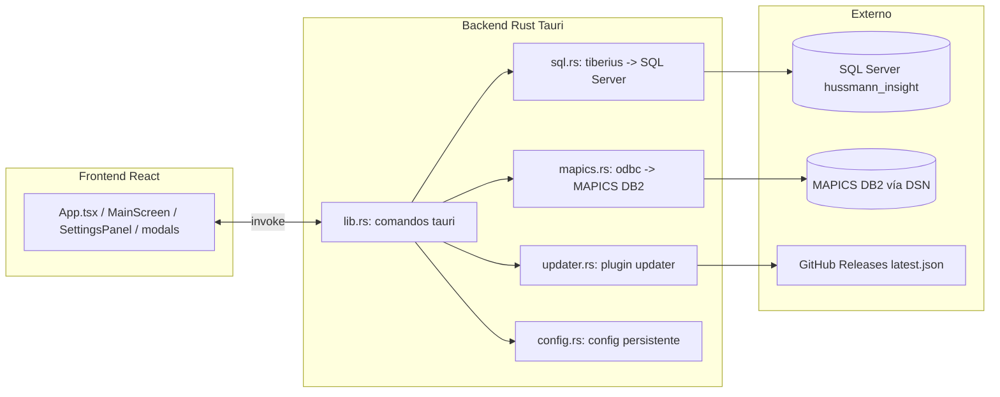

# Arquitectura

## Diagrama general

## Componentes

- **Frontend (src/)**: App.tsx (login + flujo), MainScreen, SettingsPanel, modals, hooks (useConfig, usePackoutFlow, useItemImages, useUpdater), lib (config.ts, packout.ts).
- **Backend (src-tauri/src/)**:
  - `lib.rs`: define los comandos `#[tauri::command]` y el estado `AppState` (app_data_dir).
  - `config.rs`: carga/guarda `packout.config.json` en el directorio de config de la app.
  - `sql.rs`: acceso a SQL Server vía tiberius (TDS). Ver DEC-001.
  - `mapics.rs`: acceso a MAPICS vía ODBC. Ver DEC-001.
  - `updater.rs`: comandos `check_update` e `install_update` usando tauri-plugin-updater.
  - `main.rs`: entrypoint estándar Tauri.

## Configuración (config.rs)

- Archivo: `%APPDATA%/com.packout.app/packout.config.json` (en Windows).
- Estructura: `AppConfig { active_zone, sql: SqlDb, zones: Vec<Zone> }`.
- Cada `Zone` tiene: `id`, `nombre`, `estacion`, `tables`, `mapics` y `sql` opcional (override por zona).
- `SqlDb { server, database, user, password, driver }` — el campo `driver` quedó **obsoleto** tras DEC-001 (tiberius no usa driver ODBC), pero se conserva en el JSON por compatibilidad.
- `TableNames { resultados, errores, usuarios, admin, recientes, item_images }` — nombres de tablas por zona.
- Comandos de export/import de config (`export_config`, `import_config`) vía plugin dialog.

## Conexiones

- **SQL Server**: tiberius, cadena `Server=...;Database=...;User Id=...;Password=...`, puerto TCP por defecto 1433, `EncryptionLevel::Required` + `trust_cert()`. Ver `INTEGRATIONS.md`.
- **MAPICS**: ODBC con `DSN=...;UID=...;PWD=...`. Ver `INTEGRATIONS.md`.

## Flujo principal (packout)

1. Login (operador/admin) contra tablas de usuarios/admin.
2. Consulta de serie: `mapics_query_kit` → `mapics.rs`.
3. Confirmación: `mapics_insert_kit` → inserta kit en MAPICS.
4. Registro: `sql_insert_resultado` → inserta en tabla de resultados.
5. Errores: `sql_insert_error` (también escribe `packout.log` local).
6. Reimpresión: `reimprimir` → borra + inserta kit y registra reimpresión.
7. Imágenes por ítem: `sql_item_image`, `sql_save_item_image`, `sql_delete_item_image`, `sql_list_item_images` (base64 en tabla `item_images`).

## Logs

- Local: `packout.log` junto a la config (`%APPDATA%/com.packout.app/`). Se escribe en cada inicio y en errores.